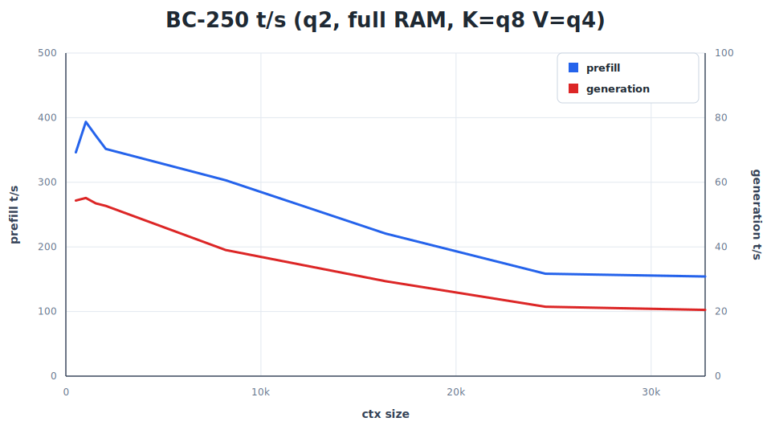

<p align="center">
  
</p>

**QuarkStar** is a small native inference engine for **Qwen3.6-35B-A3B**. 
It is self-contained and deliberately narrow, not a general GGUF runner. 
The main path is a Qwen3.6-35B-A3B-specific Vulkan graph executor with 
Q36-specific loading, prompt rendering, tool calls, KV state, HTTP server,
and coding agent. The repository also includes tools and data for GGUF,
imatrix, quality, and speed.

This project would not exist without **DwarfStar**, **llama.cpp and GGML**, make
sure to read the acknowledgements section, a big thank you to Salvatore Sanfilippo 
aka Antirez and Georgi Gerganov and all the other contributors.

Model support is intentionally opportunistic. The project follows the best open
weights for useful local machine sizes, especially 16 GB machines and 24/32 GB
workstations. A model may be removed when a better replacement arrives.

# So, what can I do with this software?

* You can run a quite capable model on your very cheap hardware, a $150 machine, 
the BC-250. Even if you don't have enough RAM, with SSD streaming, you can still 
run it at a decent speed.

## Requirements

QuarkStar for now targets one specific hardware configuration:

* **AMD BC-250** (Cyan Skillfish, RDNA 2, 24 CUs / 1536 shaders, 16 GB
  unified GDDR6) — the ex-PS5 mining board.
* **Linux** with a recent Mesa stack. The RADV driver is required; AMDVLK is
  not tested.
* **Vulkan 1.3** with `VK_EXT_external_memory_host`. This is what lets us
  map the GGUF directly as a `VkBuffer` with zero copies. Check with
  `vulkaninfo | grep external_memory_host`.
* **BIOS**: modded firmware with the Chipset menu unlocked. Set Integrated
  Graphics → UMA Mode → `UMA_SPECIFIED` and VRAM allocation to `512 MB`
  (dynamic). Counterintuitively, the small split is correct: it lets the GPU
  grow into the unified pool on demand.
* **Kernel boot parameters**: add `ttm.pages_limit=3959290
  ttm.page_pool_size=3959290` to your bootloader, otherwise `amdgpu` caps
  GPU-accessible memory below 8 GB and the model will fail to load.

There is no support for discrete GPUs, integrated Intel/NVIDIA GPUs, or
Windows (Windows has no driver support for the BC-250 APU at all).

## Motivations

* Small open-weight models are already good and fit on normal personal machines, 
and they'll keep getting better.
* AI providers' flat plans keep raising prices, and not everyone can afford $3k–$5k machines.
* BC-250 is the perfect machine for that: $150, a powerful GPU, fast memory, 
decent SSD speed support, and unified memory.
* Qwen3.6-35B-A3B tolerate aggressive routed-expert quantization (recipe by Antirez).
* Qwen3.6-35B-A3B is fast as hell and can potentially run even on a toaster, Vulkan 
is compatible on paper with a huge range of devices, and with DZN and Lavapipe it 
opens up some very interesting possibilities in the future.
* Compressed KV caches and fast local SSDs make long contexts practical.
* The idea of an inference system specialized for a few models.

# AI full disclosure

* This software is developed with **strong assistance from GPT 5.5, 5.6, Claude Fable**
 and with humans leading the ideas, testing, and debugging. We say this openly because 
 it shaped how the project was built. If you are not happy with AI-developed code, this 
 software is not for you. The acknowledgement below is equally important: this would not 
 exist without `llama.cpp` and GGML, largely written by hand.

## Acknowledgements

### To antirez and ds4

QuarkStar is essentially a port of [DwarfStar](https://github.com/antirez/ds4),
redesigned for the Vulkan runtime and retargeted at Qwen3.6-35B-A3B. Where DwarfStar
went deep on Metal, we go deep on Vulkan; everything else is the same idea
adapted to a different model. I literally used DwarfStar as a bible for ideas,
porting Salvatore's ideas to QuarkStar with the help of AI.

**Special thanks to Salvatore**, he is a continuous source of inspiration for
me, and his content on YouTube has greatly improved me as a software engineer
and as a person.

This project was born with the intent of improving my skills in LLMs. It's
useful for me for inference and for learning, and I hope it will be useful for
you too.

### To llama.cpp and GGML

`q36.c` does not link against GGML, but it **exists thanks to the path opened by the
llama.cpp project and the kernels, quantization formats, GGUF ecosystem, and hard-won
engineering knowledge developed there**.
We are thankful and indebted to [`llama.cpp`](https://github.com/ggml-org/llama.cpp)
and its contributors. Their implementation, kernels, tests, and design choices were
an essential reference while building this Qwen3.6-35B-A3B specific inference path.
Some source-level pieces are retained or adapted here under the MIT license: GGUF
quant layouts and tables, CPU quant/dot logic, and certain kernels. For this
reason, and because we are genuinely grateful, we keep the GGML authors copyright
notice in our `LICENSE` file.

## Status

The software is currently very fast changing. Consider it alpha quality.
Before each release, a big QA run is executed, however instabilities
are definitely possible.

## More Documentation

The focused documents below cover development, release checks, model details,
and offline tooling. For normal usage, keep reading the next sections.

- [CONTRIBUTING.md](CONTRIBUTING.md): correctness and speed regression testing
  guide for contributors. **Read this before sending a pull request**.
- [QA_BEFORE_RELEASES.md](QA_BEFORE_RELEASES.md): the complete release test
  matrix.
- [MODEL_CARD.md](MODEL_CARD.md): the fixed Qwen3.6 architecture, tokenizer,
  quantization, and sampling assumptions used by Q36.
- [gguf-tools/README.md](gguf-tools/README.md): offline GGUF generation,
  imatrix collection, quantization tooling, and quality checks.
- [gguf-tools/imatrix/dataset/README.md](gguf-tools/imatrix/dataset/README.md):
  how the calibration prompt corpus is generated.
- [gguf-tools/quality-testing/README.md](gguf-tools/quality-testing/README.md):
  how local GGUFs are scored against OpenRouter continuations.
- [dir-steering/README.md](dir-steering/README.md): the preserved DS4 vector
  generation experiment that informed Q36's directional-steering runtime.
- [tests/test-vectors/README.md](tests/test-vectors/README.md): tracked
  llama.cpp continuation vectors used for regression checks.

## Model Weights

This implementation only works with the Qwen3.6-35B-A3B GGUFs listed
below. It is not a general GGUF loader, and arbitrary GGUF files will not have
the tensor layout, quantization mix, metadata, or optional MTP state expected by
the engine. The 2 bit quantizations provided here are verified to be actually
high quality: they behave well, work under coding agents, call tools in a reliable way.

The 2 bit quants use a very asymmetrical quantization: only the routed MoE
experts are quantized, up/gate at `IQ2_XXS`, down at `Q2_K`. They are the
majority of all the model space: the other components (shared experts,
projections, routing) are left untouched to guarantee quality. The resulting
weight footprint is roughly 10-11 GB, which fits the BC-250 with room left
for KV cache and OS.

Download one main model.

```sh
./download_model.sh q2-imatrix   # 16 GB unified memory machines
./download_model.sh q2-q4-imatrix # higher quality; stream on 16 GB machines
```

Choose one. The first target matches the compiled default path. Select the
second explicitly:

```sh
./q36 -m gguf/Qwen3.6-35B-A3B-Layers34-39Q4KExperts-OtherExpertLayersIQ2XXSGateUp-Q2KDown-Q8Rest-imatrix.gguf \
  --ssd-streaming -p "Hello"
```

The script downloads from
`https://huggingface.co/Ninnix96/Qwen3.6-35B-A3B-gguf`, stores files under
`./gguf/`, resumes partial downloads with `curl -C -`, and updates
`./q36moe.gguf` to point at the selected model for older scripts.

Then build:

```sh
make
```

The Vulkan build requires **glslc** (from the `shaderc` package) to compile
GLSL compute shaders to SPIR-V:

```sh
sudo pacman -S shaderc   # Arch / CachyOS / Bazzite
```

The normal and CPU-only builds are self-contained beyond that. They do not
require a llama.cpp checkout or GGML libraries; those are used only by explicit
optional reference targets under `make test-llama` and `make test-vectors-local`.

`gguf/Qwen3.6-35B-A3B-AntirezExperts-IQ2XXS-gateup-Q2K-down-Q8rest.gguf` is
the default model path used by all runtime binaries. Pass `-m` to select another
supported GGUF from `./gguf/`. Run `./q36 --help` and
`./q36-server --help` for the full flag list.

If you want to regenerate GGUF files or collect a new imatrix, see
[gguf-tools/README.md](gguf-tools/README.md). Those tools are meant for offline
Qwen3.6 model-building work. The native quantizer accepts Q8, F16, or BF16
inputs; imatrix collection still uses the optional llama.cpp tooling.

`./download_model.sh mtp` fetches the optional speculative decoding support
GGUF for Qwen 3.6 MoE. It can be used with the `q2-imatrix` and
`q2-q4-imatrix` main models, but must be enabled explicitly with `--mtp`. The
current MTP/speculative decoding path is still experimental: it is
correctness-gated and currently provides at most a slight speedup, not a
meaningful generation-speed win.

## Speed

Benchmarks on a **BC-250** (40 CUs unlocked, Cyan-Skillfish Governor limited
to 500-1500 MHz, 85 °C thermal ceiling — a hot summer in Italy). All runs
use the Vulkan backend with greedy decoding, `--gen-tokens 128`, and the
long context story prompt. Resident (full RAM) runs use Q8_0 K / Q4_0 V
cache. SSD streaming runs use F16 KV cache.

| Machine | Quant | Prompt | Prefill | Generation |
| --- | ---: | ---: | ---: | ---: |
| BC-250 (40 CU) | q2 | 2048 ctx | 351.60 t/s | 52.69 t/s |
| BC-250 (40 CU) | q2 | 10240 ctx | 305.44 t/s | 39.99 t/s |
| BC-250 (40 CU) | q2 | 32768 ctx | 154.20 t/s | 20.50 t/s |
| BC-250 (40 CU) | q2 SSD | 2048 ctx | 40.08 t/s | 14.91 t/s |
| BC-250 (40 CU) | q2-q4 SSD | 2048 ctx | 35.55 t/s | 10.80 t/s |



Use `q36-bench` for reproducible prefill and decode measurements. Release
builds also have a conservative BC-250 performance gate under
`make benchmark-gate`; record results on the same board and power state when
comparing changes.

## Running Models Larger Than Available Memory

Vulkan SSD streaming keeps non-routed weights resident and loads selected
routed experts into a bounded cache. Without an explicit cache size, Q36 uses
the Vulkan recommended working set, subtracts non-routed weights, and targets
80% of the reported budget:

```sh
./q36 --ssd-streaming -p "Explain radix trees."
./q36 --ssd-streaming --ssd-streaming-cache-experts 256 -p "Hello"
./q36 --ssd-streaming --ssd-streaming-cache-experts 6GB -p "Hello"
```

Warm streaming preloads a bounded popularity hotlist. Use
`--ssd-streaming-cold` for an empty cache, or
`--ssd-streaming-preload-experts N` to override the preload count.

As in DS4, an explicit routed prefix can stay fully resident:

```sh
./q36 --ssd-streaming --ssd-streaming-full-layers 4 -p "Hello"
```

Full layers are charged at their actual byte size and the remaining budget
must still hold one layer of dynamic expert slots for prefill. The default is
zero because the dynamic-only cache is faster on the BC-250. Pass
`--ssd-streaming-full-layers 0` to disable an explicit setting.

## Native Agent

Q36 includes a native coding agent. Inference is controlled inside the agent
itself, without a socket or API boundary, so the transcript and live KV state
are one session. The tools and system prompt use Qwen3.6's native tagged tool
format directly. This provides a few advantages:

- Low latency for generated text, tool calls, and new sessions.
- Live progress during long prefills.
- No OpenAI, Anthropic, or Hermes conversion in the model loop.
- The transcript and KV state cannot drift apart.
- Built-in file, search, shell, process, and web tools tuned for the model.
- Saved sessions can be switched without prefill when their KV payload is
  present.

Start the agent in the current directory, another project, or one-shot mode:

```sh
./q36-agent
./q36-agent --chdir /path/to/project
./q36-agent --non-interactive -p "Inspect the tests and fix the failure."
```

The resident Vulkan preset uses a 32768-token context and Q8_0 keys with Q4_0
values. CPU uses F16 KV. For a 100000-token agent with SSD-streamed model
weights and F16 KV, use:

```sh
./q36-agent --ssd-streaming
```

Explicit `--ctx`, `-ctk`, and `-ctv` values override the preset.

Sessions are stored in `~/.q36/kvcache`. Use `/save` to persist the current
session, `/list` to show saved sessions, and `/switch <sha>` to resume one.
The session ID remains stable across later saves. `/del <sha>` removes a saved
session. `/strip <sha>` keeps its transcript and title but removes the KV
payload; switching to a stripped session rebuilds the KV cache by prefilling
the saved text. `/compact` compacts the current context immediately.

## Benchmarking

`q36-bench` measures instantaneous prefill and generation throughput at
context frontiers instead of reporting one whole-run average. It loads the
model once, walks a fixed token sequence to frontiers such as 2048, 4096, and
6144, and uses incremental prefill so each row measures only the newly added
token interval. After each frontier it saves the live KV state to memory,
generates a fixed greedy non-EOS probe, restores the snapshot, and continues
prefill.

```sh
./q36-bench --vulkan --prompt-file tests/long_context_story_prompt.txt \
  --ctx-start 2048 --ctx-max 32768 --gen-tokens 128
```

## Capability Evaluation

`q36-eval` is a real-model integration benchmark, not a leaderboard runner.
Its 92 embedded questions are a regression subset: 25 GPQA Diamond, 25
curated SuperGPQA, 25 AIME 2025, and 17 COMPSEC cases. It loads the GGUF,
renders Qwen3.6 chat prompts, streams sampled tokens in a TUI, grades the final
answers, and prints prompt-token, generated-token, and pass/fail results.

```sh
./q36-eval --trace /tmp/q36-eval.txt
```

The default run uses a 16000-token generation budget and thinking mode. The
context is sized from the largest selected prompt plus that budget, up to the
model's 262144-token native context. Press `p` to pause, `q` to stop and print
the report, Up/Down to select a question, and Enter to queue it next. `--plain`
disables the TUI.

Use `--regrade-trace /path/to/trace.txt` to rerun the current answer extractor
and scorer on a saved trace without loading the model. A short deterministic
smoke run is:

```sh
./q36-eval --plain --questions 4 --tokens 2048 --temp 0 --seed 1
```

## CLI

One-shot prompt:

```sh
./q36 -p "Explain Redis streams in one paragraph."
```

Without `-p`, Q36 starts an interactive multi-turn chat:

```sh
./q36
q36>
```

The CLI keeps the rendered transcript and live graph KV checkpoint, so each
turn extends the previous conversation. Useful commands are `/help`, `/think`,
`/think-max`, `/nothink`, `/ctx N`, `/read FILE`, and `/quit`. Ctrl+C interrupts
the current generation and returns to `q36>`.

Thinking mode is enabled by default. Use `/nothink` or `--nothink` for direct
answers. `--mtp MTP.gguf --mtp-draft 2` enables the optional MTP speculative
path for greedy decoding. It uses `--mtp-margin` as a confidence gate and is
currently an experimental slight-speedup path.

## Server

Start a local OpenAI/Anthropic-compatible server:

```sh
./q36-server --ctx 32768 --kv-disk-dir /tmp/q36-kv --kv-disk-space-mb 8192
```

Without extra options the server keeps one mutable backend/KV checkpoint and
uses the original single graph worker. Stateless clients that resend a longer
version of the same prompt can reuse that prefix instead of pre-filling from
token zero.

`--batched-session N` opts into `N` independent resident sessions:

```sh
./q36-server --ctx 32768 --batched-session 4
```

Each active request owns one slot until it finishes; excess requests wait for
an idle slot. Assignment prefers the resident live/token prefix with the
longest match. When disk KV caching is enabled, an unmatched idle slot is
persisted before reuse. Thinking state, tool continuations, RNG, logits,
recurrent state, and full-attention KV remain session-local.

One coordinator owns model execution. Decode-ready slots coalesce for up to
2 ms and advance in one model step. Prefills run round-robin in bounded
quanta: 2048 tokens while no generation is active and 128 while any generation
is active. This prevents one large prompt from blocking every active decoder.
MTP speculative decoding is disabled in batched mode.

Resident context memory is multiplied by `N`; startup prints both the
per-session estimate and the total. Choose `N` and `--ctx` so all session KV,
recurrent state, and graph scratch fit. Backend behavior is:

| Backend | Multi-session execution |
| --- | --- |
| Vulkan resident, 2-8 decode-ready rows | Native row-batched shared projections and FFN work with private positions, recurrent state, and typed KV when graph scratch can hold every row. F16/F16 and Q8_0/Q4_0 KV are supported; other KV pairs and unsupported shapes use ordered fallback. |
| Vulkan SSD streaming | Deterministic ordered fallback, preserving expert-cache ownership. |
| CPU, batches above 8, or forced `Q36_VK_SESSION_BATCH=0` | Deterministic ordered fallback. |

Batch size one calls `q36_session_eval()` directly. If a batched step fails,
all members are invalidated so none can silently continue from a partially
advanced frontier. Ordered fallback preserves concurrency and scheduling
fairness, but does not provide the aggregate throughput gain of native Vulkan
batching.

Supported endpoints:

- `GET /v1/models`
- `GET /v1/models/qwen3.6-35b-a3b`
- `POST /v1/chat/completions`
- `POST /v1/responses`
- `POST /v1/completions`
- `POST /v1/messages`

`/v1/chat/completions` accepts the usual OpenAI-style `messages`,
`max_tokens`/`max_completion_tokens`, `temperature`, `top_p`, `top_k`,
`min_p`, `seed`, `stream`, `stream_options.include_usage`, `tools`, and
`tool_choice`. Tool schemas and calls use Qwen3.6's native tagged format, and
generated calls are mapped back to OpenAI tool calls.

`/v1/responses` accepts string or message-array input, instructions, direct
tool schemas, function-call continuations, function-call outputs, sampling
controls, reasoning controls, and `max_output_tokens`. It returns native
Responses API message, reasoning, and function-call output items. With
`stream:true`, it emits Responses API SSE events through
`response.completed`.

`/v1/messages` is the Anthropic-compatible endpoint used by Claude Code
style clients. It accepts `system`, `messages`, `tools`, `tool_choice`,
`max_tokens`, `temperature`, `top_p`, `top_k`, `stream`, `stop_sequences`,
and thinking controls. Tool uses are returned as Anthropic `tool_use`
blocks.

Both APIs support SSE streaming. In thinking mode, reasoning is streamed in
the native API shape instead of being mixed into final text. OpenAI chat
streaming also streams tool calls as soon as the `<tool_call>` opening is
recognized: the tool header is sent first, then each completed native
parameter is forwarded as a `tool_calls[].function.arguments` delta while
generation continues. The Anthropic endpoint streams thinking and text live, then emits
structured `tool_use` blocks when the generated tool block is complete.

Pass `--cors` to add `Access-Control-Allow-Origin`, methods, and headers and
to answer browser `OPTIONS` preflight requests. CORS headers are disabled by
default.

### Tool call handling and canonicalization

Qwen3.6-35B-A3B emits tool calls in its native tagged format. Tool definitions
are provided in the system prompt inside `<tools>...</tools>`. A call has one
`<function=name>` block inside `<tool_call>`, with one
`<parameter=name>` block per argument:

```text
<tool_call>
<function=list_files>
<parameter=pattern>
*.c
</parameter>
<parameter=max_depth>
2
</parameter>
</function>
</tool_call>
```

Agent clients do not send that same text back on the next request: they send
normalized OpenAI/Anthropic JSON tool-call objects. **If the server
re-rendered those objects slightly differently, the rendered byte prefix
would no longer match the live KV checkpoint** and the next turn would have
to be rebuilt.

All markers are plain ASCII. Q36 keeps the exact replay and canonicalization
machinery inherited from `ds4`, because a sampled call and its next-turn API
rendering must still be byte-identical to avoid silent KV drift.

The first line of defense is exact replay. Every tool call gets an
unguessable API tool ID, and the server remembers `tool id -> exact sampled
<tool_call> block` in a bounded in-memory map backed by radix trees. When
the client later sends that tool ID back, the prompt renderer uses the exact
bytes the model sampled, not a freshly formatted approximation. This map
can also be saved inside KV cache files, so exact replay survives server
restarts for cached histories.

**Canonicalization is only the backup path**. If the exact sampled block is
missing, or exact replay is disabled with
`--disable-exact-tool-replay`, the server renders deterministic native Qwen
tags from the JSON tool object, following schema property order. After a
tool-call turn, it compares the live sampled token stream with the prompt
that the next client request will render. If needed, it rewrites the live
checkpoint, or falls back to an older disk KV snapshot and replays only the
suffix. This keeps the model continuation aligned with the stateless API
transcript.

During generation, the server also treats native Qwen syntax differently from
payload. When the model is emitting stable protocol structure — tool,
function, and parameter tags — sampling is forced to `temperature=0` so
the tool call stays parseable. This greedy mode does **not** apply to
argument values: string contents inside the arguments JSON, including file
contents and edit text, use the request's normal sampling settings. That
separation is important: deterministic decoding is helpful for syntax, but
can create repeated text when applied to long code or file bodies.

Minimal OpenAI example:

```sh
curl http://127.0.0.1:8000/v1/chat/completions \
  -H 'Content-Type: application/json' \
  -d '{
    "model":"qwen3.6-35b-a3b",
    "messages":[{"role":"user","content":"List three Redis design principles."}],
    "stream":true
  }'
```

### Agent Client Usage

`q36-server` can be used by local coding agents that speak OpenAI-compatible
chat completions. Start the server first, and set the client context limit
no higher than the `--ctx` value you started the server with:

```sh
./q36-server --ctx 32768 --kv-disk-dir /tmp/q36-kv --kv-disk-space-mb 8192
```

On a BC-250 with 16 GB of unified memory, weights take ~10–11 GB at Q2,
which leaves roughly 2–4 GB for KV cache, scratch buffers, OS and your
client. The model's native context is 256K tokens, but the live context must
still fit in available memory. Disk KV checkpoints avoid repeated prefill and
preserve sessions across restarts; they do not enlarge the active context
window.

The `384000` output limit in the configs below avoids token caps since the
model is able to generate very long replies. The server still stops when
the configured context window is full.

For **opencode**, add a provider and agent entry to
`~/.config/opencode/opencode.json`:

```json
{
  "$schema": "https://opencode.ai/config.json",
  "provider": {
    "q36": {
      "name": "q36.c (local)",
      "npm": "@ai-sdk/openai-compatible",
      "options": {
        "baseURL": "http://127.0.0.1:8000/v1",
        "apiKey": "q36-local"
      },
      "models": {
        "qwen3.6-35b-a3b": {
          "name": "Qwen 3.6 MoE (q36.c local)",
          "limit": {
            "context": 32768,
            "output": 384000
          }
        }
      }
    }
  },
  "agent": {
    "q36": {
      "description": "Qwen 3.6 MoE served by local q36-server",
      "model": "q36/qwen3.6-35b-a3b",
      "temperature": 0
    }
  }
}
```

For **Pi**, add a provider to `~/.pi/agent/models.json`:

```json
{
  "providers": {
    "q36": {
      "name": "q36.c local",
      "baseUrl": "http://127.0.0.1:8000/v1",
      "api": "openai-completions",
      "apiKey": "q36-local",
      "compat": {
        "supportsStore": false,
        "supportsDeveloperRole": false,
        "supportsReasoningEffort": true,
        "supportsUsageInStreaming": true,
        "maxTokensField": "max_tokens",
        "supportsStrictMode": false,
        "thinkingFormat": "qwen",
        "requiresReasoningContentOnAssistantMessages": true
      },
      "models": [
        {
          "id": "qwen3.6-35b-a3b",
          "name": "Qwen 3.6 MoE (q36.c local)",
          "reasoning": true,
          "thinkingLevelMap": {
            "off": null,
            "minimal": "low",
            "low": "low",
            "medium": "medium",
            "high": "high",
            "xhigh": "xhigh"
          },
          "input": ["text"],
          "contextWindow": 32768,
          "maxTokens": 384000,
          "cost": {
            "input": 0,
            "output": 0,
            "cacheRead": 0,
            "cacheWrite": 0
          }
        }
      ]
    }
  }
}
```

Optionally make it the default Pi model in `~/.pi/agent/settings.json`:

```json
{
  "defaultProvider": "q36",
  "defaultModel": "qwen3.6-35b-a3b"
}
```

For **Claude Code**, use the Anthropic-compatible endpoint. A wrapper like
this matches the local `~/bin/claude-q36` setup:

```sh
#!/bin/sh
unset ANTHROPIC_API_KEY

export ANTHROPIC_BASE_URL="${Q36_ANTHROPIC_BASE_URL:-http://127.0.0.1:8000}"
export ANTHROPIC_AUTH_TOKEN="${Q36_API_KEY:-q36-local}"
export ANTHROPIC_MODEL="qwen3.6-35b-a3b"

export ANTHROPIC_CUSTOM_MODEL_OPTION="qwen3.6-35b-a3b"
export ANTHROPIC_CUSTOM_MODEL_OPTION_NAME="Qwen 3.6 MoE local q36"
export ANTHROPIC_CUSTOM_MODEL_OPTION_DESCRIPTION="q36.c local GGUF"

export ANTHROPIC_DEFAULT_SONNET_MODEL="qwen3.6-35b-a3b"
export ANTHROPIC_DEFAULT_HAIKU_MODEL="qwen3.6-35b-a3b"
export ANTHROPIC_DEFAULT_OPUS_MODEL="qwen3.6-35b-a3b"
export CLAUDE_CODE_SUBAGENT_MODEL="qwen3.6-35b-a3b"

export CLAUDE_CODE_DISABLE_NONESSENTIAL_TRAFFIC=1
export CLAUDE_CODE_DISABLE_NONSTREAMING_FALLBACK=1
export CLAUDE_STREAM_IDLE_TIMEOUT_MS=600000

exec "$HOME/.local/bin/claude" "$@"
```

Claude Code may send a large initial prompt, often around 25k tokens,
before it starts doing useful work. Keep `--kv-disk-dir` enabled: after the
first expensive prefill, the disk KV cache lets later continuations or
restarted sessions reuse the saved prefix instead of processing the whole
prompt again.

## Thinking Modes

Qwen3.6-35B-A3B has distinct non-thinking and thinking modes, controlled
natively by `<think>...</think>` blocks rendered into the prompt. The server
defaults to thinking mode.

Mapping of API thinking controls to prompt rendering:

- Anthropic `thinking: {"type":"enabled"}` → thinking on (default).
- Anthropic `thinking: {"type":"disabled"}` → thinking off.
- OpenAI `reasoning_effort=low|medium|high|xhigh` → all map to thinking on
  with a soft budget hint. Qwen3.6 does not expose distinct reasoning
  levels at the model layer; the budget controls when the server stops
  feeding thinking tokens, not how the model decides to reason.
- `reasoning_effort=minimal` or omitted with no thinking flag → thinking on.
- Explicit non-thinking: `thinking:{"type":"disabled"}`, `think:false`, or
  appending the chat-template flag `enable_thinking=false`.

## KV Cache Quantization

Q36 supports `f16`, `q8_0`, and `q4_0` KV rows. Select key and value types
independently with `-ctk` and `-ctv`:

```sh
./q36 -ctk q8_0 -ctv q4_0 -p "Explain radix trees."
./q36-server -ctk f16 -ctv f16
```

Resident Vulkan frontends default to Q8_0 keys and Q4_0 values. CPU and Vulkan
SSD streaming default to F16 for both. Explicit flags always override these
defaults. KV quantization reduces context memory; it does not change model
weight quantization or extend Qwen3.6's 262144-token native context.

## Disk KV Cache

Chat/completion APIs are stateless: agent clients usually resend the whole
conversation every request. `q36-server` first tries the cheap exact
token-prefix check, then falls back to comparing rendered prompt bytes with
decoded checkpoint bytes. The live in-memory checkpoint covers the current
session; the disk KV cache makes useful prefixes survive session switches
and server restarts.

The default server has one live KV cache. With `--batched-session N`, each
resident slot has one and active slots are never evicted. When an unrelated
request reuses an idle slot, its old checkpoint can only be resumed without
re-processing if it was written to the disk KV cache.

Enable it with:

```sh
./q36-server --kv-disk-dir /tmp/q36-kv --kv-disk-space-mb 8192
```

The cache key is the SHA1 of the rendered byte prefix, and files are named
`<sha1>.kv`. The Q36 payload still stores the exact token IDs and graph
state for that prefix. This matters for continued chats: the model may have
generated one token whose decoded text is later sent back by a client as two
canonical prompt tokens. A rendered byte-prefix hit can still reuse the
checkpoint and tokenize only the new suffix. The file is intentionally
written with ordinary `read`/`write` I/O, not `mmap`, so restoring cache
entries does not add more VM mappings to a process that already maps the
model.

Tool calls also keep a bounded exact-replay map keyed by unguessable tool
IDs, so client JSON history can be rendered back to the exact sampled text.
The RAM map keeps up to 100000 IDs by default; tune it with
`--tool-memory-max-ids`. Use `--disable-exact-tool-replay` to disable this
and fall back to canonical JSON-to-Qwen rendering.

On disk, a cache file is:

```text
KVC fixed header, 48 bytes
u32 rendered_text_bytes
rendered_text_bytes of UTF-8-ish token text
Q36 session payload, payload_bytes from the KVC header
optional tool-id map section
```

The fixed header is little-endian:

```text
0   u8[3]  magic = "KVC"
3   u8     version = 1
4   u8     routed expert quant bits, currently 2
5   u8     save reason: 0 unknown, 1 cold, 2 continued, 3 evict, 4 shutdown
6   u8     extension flags, bit 0 = appended tool-id map
7   u8     reserved
8   u32    cached token count
12  u32    hit count
16  u32    context size the snapshot was written for
20  u8[4]  reserved
24  u64    creation Unix time
32  u64    last-used Unix time
40  u64    Q36 session payload byte count
```

The rendered text is the tokenizer-decoded text for the cached token
prefix. It is both the human-inspectable prefix and the lookup identity:
its SHA1 is the filename, and a file is reusable only when those bytes are
a prefix of the incoming rendered prompt. After load, the exact checkpoint
tokens from the Q36 payload remain authoritative, and only the incoming
text suffix after the cached bytes is tokenized.

The optional tool-id map is present only when header extension bit 0 is
set. Appended sections use fixed bit order, so future extension bits can
add fields without ambiguity. The map stores unguessable API tool call IDs
back to the exact `<tool_call>` block the model sampled. Only mappings whose
block is present in the rendered cached text are stored. This lets restarted
servers render later client history byte-for-byte like the original model
output, even if the client reorders JSON arguments.

The current tool-id map section is:

```text
0   u8[3]  magic = "KTM"
3   u8     version = 1
4   u32    entry count

For each entry:
0   u32    tool id byte length
4   u32    sampled block byte length
8   bytes  tool id
... bytes  exact sampled <tool_call> block
```

The section is auxiliary replay memory, not model state. A cache hit
restores the session payload first, then loads the map if present. Before
rendering a request, the server can also scan cache files for the tool IDs
present in the client history and load just those mappings, so an exact
replay can survive server restarts even when the matching KV snapshot is
not the one ultimately used for the rendered-prefix hit.

The current Q36 session payload starts with fourteen little-endian `u32`
fields for version 2, or sixteen fields for typed-KV version 3:

```text
0   magic = "Q36 "
1   payload version = 2 (f16 KV) or 3 (typed KV)
2   saved context size
3   prefill chunk size
4   checkpoint token count
5   vocabulary size
6   layer count
7   KV head count
8   key head dimension
9   value head dimension
10  recurrent convolution width
11  recurrent convolution dimension
12  recurrent state dimension
13  recurrent dt rank
14  K cache type (version 3 only)
15  V cache type (version 3 only)
```

Then it stores:

- `u32[token_count]` checkpoint token IDs.
- `float32[vocab_size]` logits for the next token after that checkpoint.
- For each full-attention layer: a `u32` row count followed by all K and V
  rows in the selected `f16`, `q8_0`, or `q4_0` cache type.
- For each recurrent layer: its `float32` convolution history and recurrent
  state tensors.

Version 1 is a legacy token-only input. Loading it rebuilds runtime state by
prefilling the saved token sequence; current disk KV writes use version 2 or
3 and persist the complete Qwen full-attention and recurrent state.

The logits are raw IEEE-754 `float32` values from the host `q36_session`
buffer. They are saved immediately after the checkpoint tokens so a loaded
snapshot can sample or continue from the exact next-token distribution
without running one extra decode step. MTP draft logits/state are not
persisted; after loading a disk checkpoint the draft state is invalidated
and rebuilt by normal generation.

The tensor payload is q36-specific KV/session state, not a generic
inference graph dump. It is expected to be portable only across compatible
`q36.c` builds for this model layout.

The cache stores checkpoints at four moments:

- `cold`: after a long first prompt reaches a stable prefix, before
  generation.
- `continued`: when prefill or generation reaches the next absolute aligned
  frontier.
- `evict`: before an unrelated request replaces the live in-memory session.
- `shutdown`: when the server exits cleanly.

Cold saves intentionally trim a small token suffix and align down to a
prefill chunk boundary. This avoids common BPE boundary retokenization
misses when a future request appends text to the same prompt. The defaults
are conservative: store prefixes of at least 512 tokens, cold-save prompts
up to 30000 tokens, trim 32 tail tokens, and align to 2048-token chunks.

Continued saves use the same alignment and are written only when the live
graph naturally reaches an absolute frontier. With the defaults this means
roughly every 10k tokens, independent of where the first cold checkpoint
landed, so long generations leave restart points behind without persisting
the fragile final few tokens.

Important knobs:

- `--kv-cache-min-tokens`
- `--kv-cache-cold-max-tokens`
- `--kv-cache-continued-interval-tokens`
- `--kv-cache-boundary-trim-tokens`
- `--kv-cache-boundary-align-tokens`
- `--tool-memory-max-ids`
- `--disable-exact-tool-replay`

The cache directory is disposable. If behavior looks suspicious, stop the
server and remove it. You can investigate what is cached with `hexdump`,
since the KV cache files include the verbatim prompt cached.

## Backends

The default graph backend is Vulkan on Linux:

```sh
./q36 -p "Hello" --vulkan
```

There is also a CPU reference/debug path:

```sh
./q36 -p "Hello" --cpu
make cpu
./q36
./q36 -p "Hello"
```

Do not treat the CPU path as the production target. The CLI and `q36-server`
support the CPU backend for reference/debug use and share the same KV
session and snapshot format as Vulkan, but normal inference should use
Vulkan.

## Steering

Q36 can edit attention and FFN outputs with the same projection used by DS4:

```text
y = y - scale * direction[layer] * dot(direction[layer], y)
```

The steering file is a flat `40 x 2048` native-endian `f32` matrix with one
normalized direction per Qwen layer. Positive scales remove the represented
direction; negative scales amplify it. FFN steering defaults to `1` when a
file is supplied without an explicit scale:

```sh
./q36 -p "Write tersely" \
  --dir-steering-file qwen-direction.f32 \
  --dir-steering-ffn 0.8
```

`--dir-steering-attn F` applies the same edit after attention outputs. With no
file, or with both scales set to zero, inference follows the normal path. CPU
and Vulkan prefill and decode all apply the same operation; Vulkan keeps the
matrix resident and projects activations in place.

## Testing And Release QA

The release checks are split so quick source tests do not require loading the
model:

```sh
make test                 # unit, parser, protocol, cache and fixture tests
make test-vulkan          # isolated Vulkan kernel coverage
make test-model           # generation, CPU/Vulkan and fusion parity
make test-session-batch   # Vulkan 1/2/4/8-session full-logit/state oracle
make test-server-live     # live HTTP, CORS and Responses API smoke test
make test-server-batching # concurrent requests against one 4-slot server
make benchmark-session-batch # old, 1/2/4/8-slot, and ordered-fallback server runs
make test-streaming       # resident/warm/cold/pressure/full-layer matrix
make benchmark-gate       # conservative BC-250 throughput floor
make release-build-check  # Vulkan and CPU release builds with -Werror
```

`make test-release` runs the complete sequence, including reference vectors.
The manual hardware, server, agent, long-context, power and sign-off checklist
is in [`QA_BEFORE_RELEASES.md`](QA_BEFORE_RELEASES.md). Distributed inference
is outside Q36's release scope.

## Test Vectors

`tests/test-vectors` contains committed short and long-context continuation
vectors captured from llama.cpp with the Qwen3.6 Q8_0 reference GGUF. They are
the default offline reference, so building and testing Q36 does not require
llama.cpp or GGML libraries.

The fixtures use greedy decoding, thinking disabled, and `top_logprobs=20`.
Private vectors are generated by the optional local llama.cpp capture tool and
compared by token bytes, so tokenizer/template or attention regressions show
up before they become long generation failures.

The reference workflows are:

```sh
make test-reference        # tracked, reproducible results
make test-vectors-local LLAMA_BUILD_DIR=llama.cpp/build
make test-reference-local  # ignored local capture
make test-llama LLAMA_BUILD_DIR=llama.cpp/build  # optional live comparison
```

Hosted official-model comparisons use OpenRouter and the native Q36 scorer;
see `gguf-tools/quality-testing/README.md`. The API key and private response
captures stay outside version control.

## Debugging Notes

When a generation looks wrong, three small tools are usually enough to get
a first answer:

```sh
./q36 --dump-tokens -p "..."
./q36 --dump-logprobs /tmp/out.json --logprobs-top-k 20 --temp 0 -p "..."
./q36-server --trace /tmp/q36-trace.txt ...
```

- `--dump-tokens` tokenizes the `-p` or `--prompt-file` string exactly as
  written, recognizes Qwen protocol specials (`<|im_start|>`, `<|im_end|>`,
  `<think>`, `</think>`, `<tool_call>`, `</tool_call>`, `<tools>`,
  `</tools>`), and then exits before inference starts. Useful for confirming
  that a tool block tokenizes the way you expect: the closing marker
  `</tool_call>` is plain ASCII and splits as ordinary BPE tokens, not as a
  single special.
- `--dump-logprobs` stores a greedy continuation with the top local
  alternatives at each step, which helps separate sampling choices from
  logit/model issues.
- `q36-server --trace` writes the rendered prompts, cache decisions,
  generated text, and tool-parser events for a whole agent session.

## Logo

The QwarkStar logo is an AI-edited version of the DwarfStar logo.
DwarfStar is designed by hand by Salvatore Sanfilippo, made more
graphical with AI, and manually reworked by Ben Gnomino, whose human touch made it rock. As always, all credits go to Salvatore.
